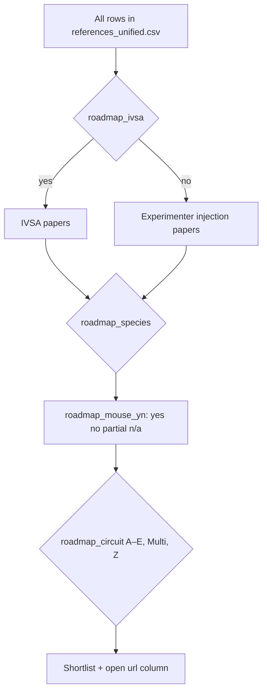

# references_forOpioid

Curated reference lists for **opioid intravenous self-administration (IVSA)** and **experimenter-administered opioid injection** studies in rodent neuroscience (with an emphasis on circuits, methods, and imaging).

Source spreadsheets are merged into one table for filtering and sorting.

## Files

| File | Description |
| --- | --- |
| [`data/references_unified.csv`](data/references_unified.csv) | All rows, unified columns |
| [`build_from_xlsx.py`](build_from_xlsx.py) | Regenerate CSV/README from local `.xlsx` copies |

## Regenerate from Excel

Requires Python 3 with `pandas` and `openpyxl` (`pip install pandas openpyxl`).

```bash
python build_from_xlsx.py \
  --ivsa path/to/opioid_ivsa_paper_index_v3.xlsx \
  --injection "path/to/opioid_injection_morphine_fentanyl_circuit_papers (1).xlsx"
```

## Summary counts

- **IV self-administration:** 45 papers
- **Experimenter-administered injection:** 26 papers

### By fine-grained category

| Paradigm | Category | N |
| --- | --- | ---: |
| Experimenter-administered injection | Fentanyl injection | 7 |
| Experimenter-administered injection | Morphine injection | 15 |
| Experimenter-administered injection | Review / methods | 4 |
| IV self-administration | Fentanyl IVSA | 9 |
| IV self-administration | Heroin IVSA | 15 |
| IV self-administration | Morphine IVSA | 8 |
| IV self-administration | Oxycodone IVSA | 4 |
| IV self-administration | Remifentanil IVSA | 5 |
| IV self-administration | Review/Methods | 4 |

## Hierarchical roadmap (narrowing the list)

Use the CSV in decision order: **`roadmap_ivsa`** → **`roadmap_mouse_yn`** (or **`roadmap_species`**) → **`roadmap_circuit`**. Circuit labels (**A–E**, **Z**, **Multi**) are auto-tagged from `title`, `brain_region`, `method_family`, and `neuroscience_methods` (keyword heuristics). Always confirm in the original paper.

### Step 1: Intravenous self-administration (IVSA)?

| `roadmap_ivsa` | Meaning | Count |
| --- | --- | ---: |
| **yes** | IVSA model | 45 |
| **no** | Experimenter-administered injection (not IVSA) | 26 |

### Step 2: Mouse? (yes / no / partial / n/a)

| `roadmap_mouse_yn` | How to read it | Count |
| --- | --- | ---: |
| **yes** | Mouse-only (or clearly mouse primary) experimental row | 25 |
| **no** | Rat-only, other species, or rodent unspecified | 36 |
| **partial** | Explicit mouse + rat in `species` | 2 |
| **n/a** | Review / methods row; use `species` and title instead | 8 |

**Finer species bucket** (`roadmap_species`, optional third sort key):

| `roadmap_species` | Count |
| --- | ---: |
| Rat | 35 |
| Mouse | 25 |
| Review / cross-species (see `species` column) | 8 |
| Mouse + rat | 2 |
| Rodent (unspecified) | 1 |

### Step 3: Circuit / region bucket (`roadmap_circuit`)

| Code | What it roughly marks |
| --- | --- |
| **A** | Mesolimbic & striatum: VTA, NAc, dorsal striatum, ventral pallidum, terminal dopamine readouts |
| **B** | Prefrontal / prelimbic cortex and cortico-striatal or cortico-midbrain emphasis |
| **C** | Extended amygdala: amygdala, CeA, BNST |
| **D** | Thalamus (incl. PVT), habenula, hypothalamus / LH |
| **E** | Hippocampus (e.g., CA1) |
| **Multi** | Two or more buckets tied (keywords overlap) |
| **Z** | Reviews, purely behavioral IVSA rows without region keywords, or not tagged from this index |

**Counts in this snapshot:**

| `roadmap_circuit` | N |
| --- | ---: |
| Z — IVSA behavioral / no circuit tag in index | 22 |
| A — Mesolimbic & striatum (VTA, NAc, striatum, VP, dopamine endpoints) | 18 |
| Z — Not tagged / distributed or unclear | 9 |
| Z — Review / survey (use title for topics) | 8 |
| B — Cortex & cortico-striatal / cortico-midbrain | 5 |
| D — Thalamus, habenula, hypothalamus | 3 |
| C — Extended amygdala / BNST / CeA | 2 |
| E — Hippocampus | 1 |
| Multi (A + C) — overlapping keywords; check `title` / `brain_region` | 1 |
| Multi (A + B) — overlapping keywords; check `title` / `brain_region` | 1 |
| Multi (A + D) — overlapping keywords; check `title` / `brain_region` | 1 |

### Visual map (same decisions)



### Quick filter examples (spreadsheet / pandas)

- **IVSA + mouse + PFC-ish:** `roadmap_ivsa` = yes, `roadmap_mouse_yn` = yes, `roadmap_circuit` contains `B`.
- **Injection + NAc / VTA:** `roadmap_ivsa` = no, sort `roadmap_circuit` for **A**.
- **In vivo imaging during behavior:** filter `in_vivo_imaging` = yes (orthogonal to the roadmap steps).

## Column guide (`references_unified.csv`)

| Column | Meaning |
| --- | --- |
| `paradigm` | IV self-administration vs experimenter-administered injection |
| `category` | Drug or topic subgroup (e.g., Heroin IVSA, Fentanyl injection) |
| `citation` | Short citation string |
| `year` | Publication year when parsed or provided |
| `title` | Title or short description |
| `drug` | Opioid or drug focus |
| `species` | Species |
| `paper_type` | Review vs experimental (injection set) |
| `exposure_paradigm` | Dosing / exposure description (injection set) |
| `route` | Route of administration (injection set) |
| `acute_chronic` | Acute, chronic, or withdrawal context (injection set) |
| `brain_region` | Region or circuit emphasis (injection set) |
| `short_conclusion` | One-line takeaway |
| `method_family` | High-level methods bucket |
| `neuroscience_methods` | Methods detail |
| `imaging_type` | Modalities when specified (injection set) |
| `in_vivo_imaging` | yes / no |
| `confidence` | Indexing confidence |
| `notes` | Extra notes (IVSA set) |
| `url` | PubMed or publisher link |
| `roadmap_ivsa` | **yes** = IVSA; **no** = experimenter-administered injection |
| `roadmap_mouse_yn` | **yes** / **no** / **partial** / **n/a** for reviews (mouse gate) |
| `roadmap_species` | Mouse vs rat vs mixed vs review-oriented grouping (quick filter) |
| `roadmap_circuit` | Circuit bucket **A–E**, **Multi**, or **Z** (keyword heuristic; see README roadmap) |
